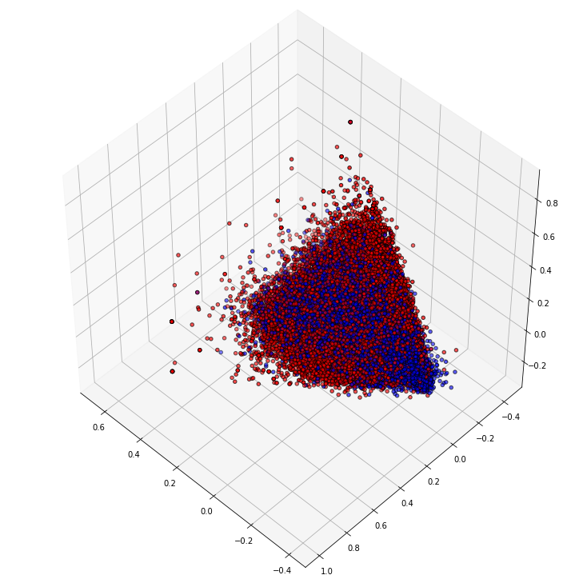
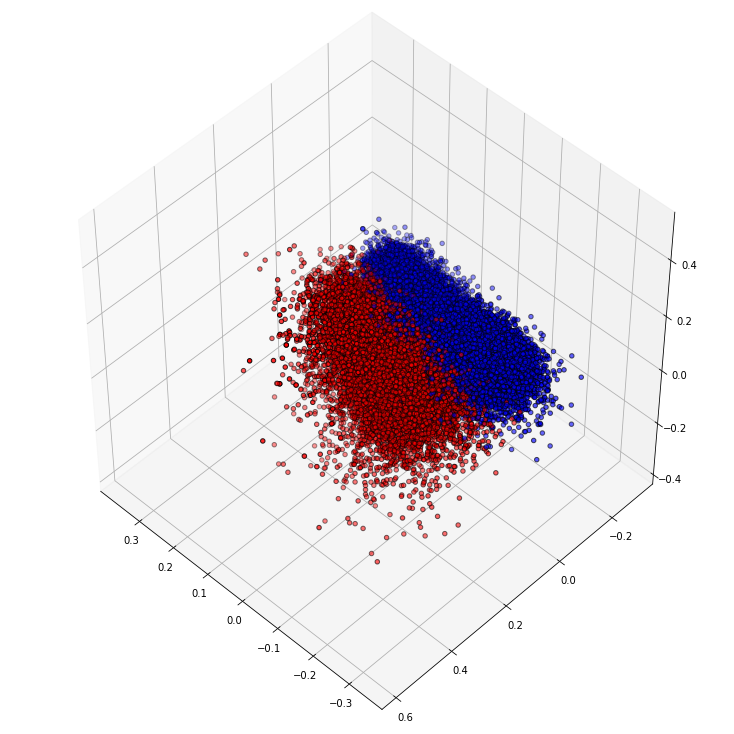
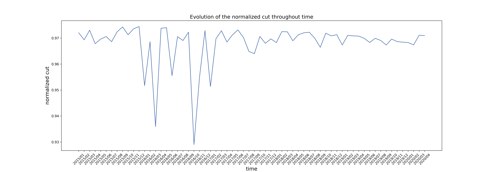
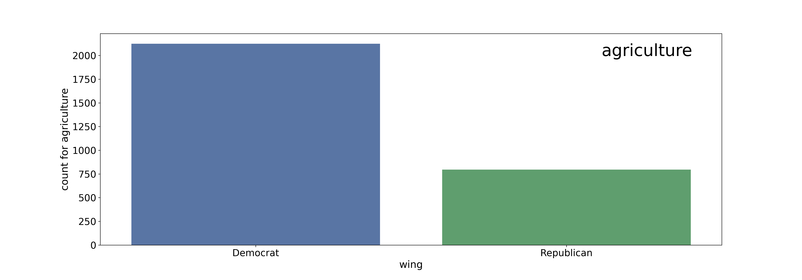
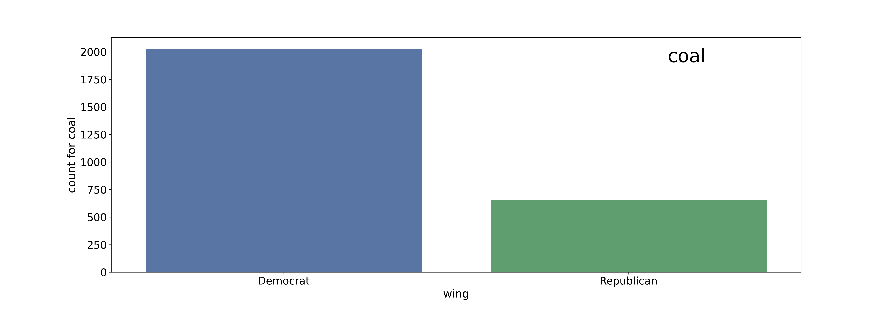
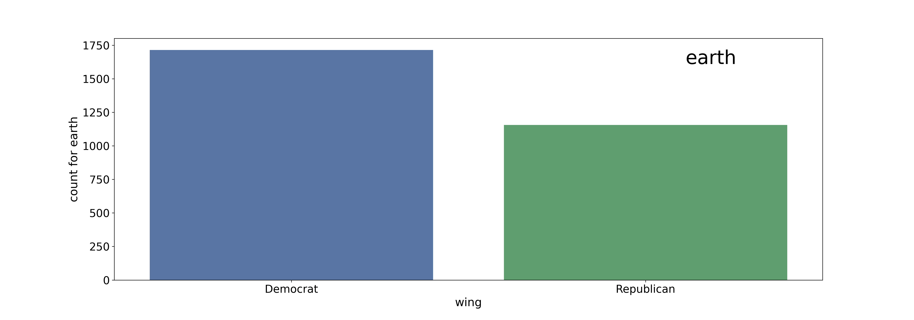
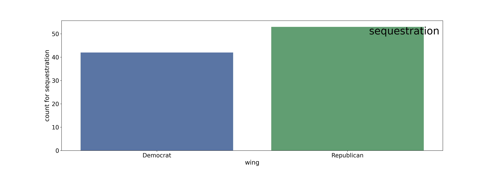
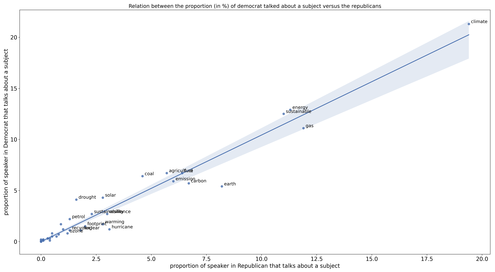
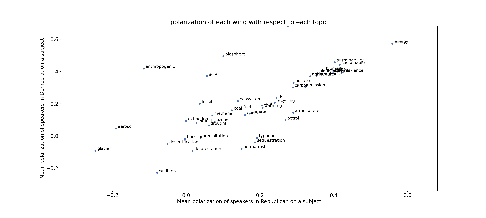
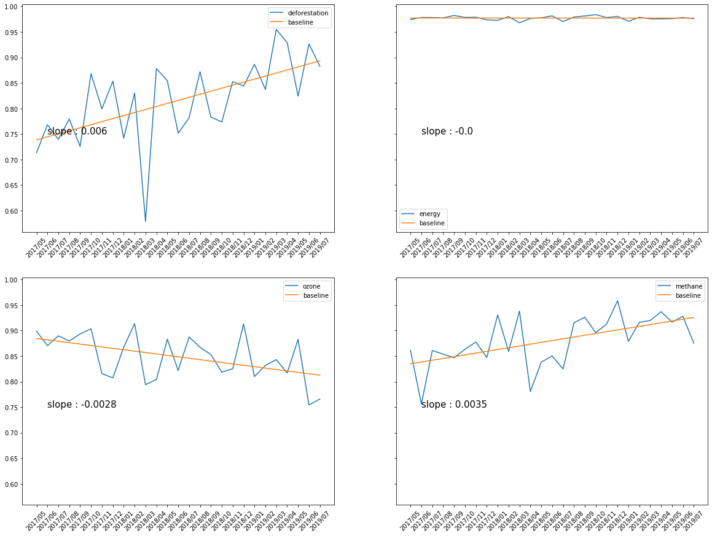

### Word embedding 

Word2Vec is a word embedding technique used to compute a low-dimensional vector capturing the semantic meaning of a word. It aims to quantify and categorize semantic similarities between linguistic items based on their distributional properties in large samples of language data. Once we have a N-dimensional vector representing the semantic of a word we can compute such a vector for every quotation in the dataset by simply taking the mean of every word it contains. Therefore, in theory, two quotes at the different ends of the spectrum should have a large distance between them and this would let us compute a "semantic distance" between quotes. 

We chose to use a pretrained model with vector of dimensions N = 300. This model contained already all the word we encountered in selected quotation of Quotebank. 

We then added the polarization feature to each point to evaluate if the difference in the polarization has a reality in the semantic used by these speakers. Here we plotted the representation in the 3 principle components (computed with PCA).

    

The points in red represent the points that are polarized above the mean value and the blue point are less polarized then the average. We cans ee that there is no clear clustering between those two groups. Nevertheless that can be due to the fact that a lot of points are only "mildly polarized" and thus two points of different colors might end up with a very close polarity score. If we only considered the points that are strongly polarized, i.e. the 15% that are the most polarized and the 15% that are the less polarized we end up with the following structure :

    

Where we see a clear difference between the two cluster. This means that **there is a semantic difference** is the language between two messages that are polarized differently. Two persons that have a speech that is polarized differently tends to diverge semanticaly speaking.

We can make the hypothesis that during the last year the debate might get more and more polarized and the semantic difference might increase between two people that have different opinion. To assess this difference we can use a metric used in this <a href="https://ieeexplore.ieee.org/document/8181508">paper</a> to compute the distance between two clusters based on the sentiment. It takes in account the ratio between the distance intra-cluster and inter-cluster. It thus gives one score for how much the two groups are clustered. With our assumption we would expect to find a increasing value of the metric. Nevertheless here is the serie of value we obtained :

    

As we can see on the graph, this is not exactly what we obtained. In the first place, the huge variation in 2016 are actually due to the lack of data during these month which actually leads to noisy values. In the second place we can observe that the normalized cut throughout the years seem to be rather high (comprable to the paper's value) but really steady. Thre doesn't seem to be an overall increasing semantic difference between the group that is polarized positively and negatively. 

### Your polarization

Word2Vec is also good for handling user input. Now you can try to input what you think about the climate change and the program will be able to tell you who is close from you on the political compass and plot your sentence among all the other present in the dataset.

<!-- TODO INSERT PHOTO OF EXAMPLE AND TELL TO GO ON A SPECIAL NOTEBOOK -->

### Polemic Topics

Some topics might be more improtant for personalities from one wing then one from another. These topic are thus important in politics because they might convince a lot of electors to vote for someone if they feel they care about the same thing. These subjects are thus really important. We would thus like to find out, for each political wing, which topic they take ownership of.

At first we tried to look at the occurences of each topics in each wing. Here are the result for some example topics :

    

    

    

    

    

Nevertheless, we can see that most of these graphs shows an important presence of the democrat in most of the topics. That due to the fact that overall, more democrat talk about these kind of issues than republican.

So we need to study the proportion of the speaker of each wing that talked about each of these issues to get rid of these problem. We thus end up with this graph :

    

In this one we see that both wings seemed to answer each other pretty well. Nevertheless some topics tends to have a small be more slightly more used by a wing then by the other. For instance, republicans talk more about **hurricane** or **earth** as the democrat would do. That's not really surprising because as <a href="https://www.nbcnews.com/think/opinion/if-republicans-really-cared-about-hurricane-victims-they-d-stop-ncna1238686">this article</a> suggests is that Republican tend to talk a lot about hurricane but not necessarly to talk about deeper problem of climate. That's allows what can suggests the wider utilization of **earth**. On the other hand democrat are more inclined to talk about **coal**, **energies**, or **solar** power.

Now we can try to determine which topic is polemic. To determine this we will try to assess the sentiment distribution for each topic with regard to the wing of the speaker. In other words, see if speakers of a wing tend to be more polarized than speakers of the other about precise subjects. 

    

We can see on this graph that some subjects have a really different mean polarization between speakers of different wings. Among these we can find subject for which the difference is statistically significant with a confidence of interval of 90% :
<ul>
    <li>agriculture</li>
    <li>atmosphere</li>
    <li>climate</li>
    <li>fossil</li>
    <li>petrol</li>
    <li>wildfire</li>
    <li>sustainable</li>
    <li>sequestration</li>
    <li>sustainability</li>
</ul>

Also some other topics have a big difference in polarization but the small amount of speakers dealing with these makes it not statistically significant.

## Semantic Separation

Another way to assess the polarization is the way the semantic varies between the speakers for each topic that are polarized positively and negatively as we did for the whole group before. In this we hope to find, throughout time, an evolution in the way the speakers argue about particular topics. If the distance increases we could deduce that the semantic difference in the speeches tends to grow over time showing that the subject becomes more and more cleaving. We also think we could find subject for which this distance remains steady, meaning the debate tends to remain the same overtime. Finally there might be topics for which the speech tends to become more and more similar. The normalized cut would reduce. Indeed we find subject following each of these trends.

    

As we see here, speeches about **deforestation** tends to get more and more polarized semanticaly. **Methane** follows a similar track but half as fast. The debate on **energy** has a high distance between the two groups but this distance is constant. The debate and the polarization doesn't seem to vary so much over time. More over we can see that the debates on **ozone** tend to be less and less cleaving. That may be due to the fact that this problem that emergered in the late 90's is now considered less important than other or that every one reaches a similar opinion, using the same term and same amount of polarization in there speeches. On the other hand, the awarness about deforestation has risen these last year following the wildfires that occured in Amazonia for instance.

