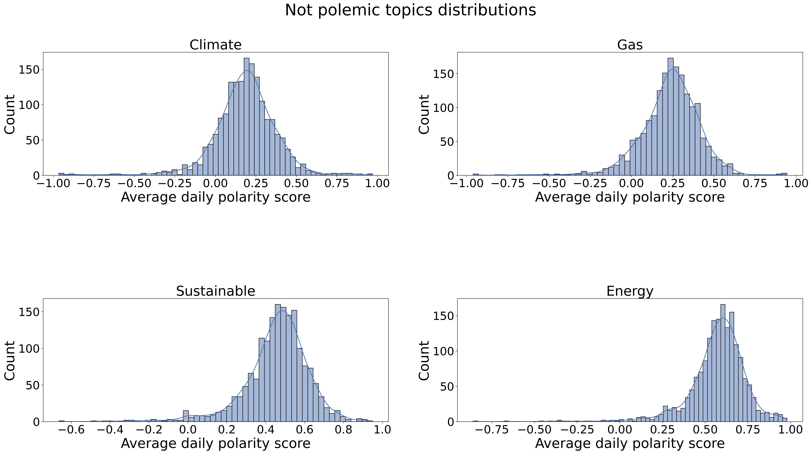
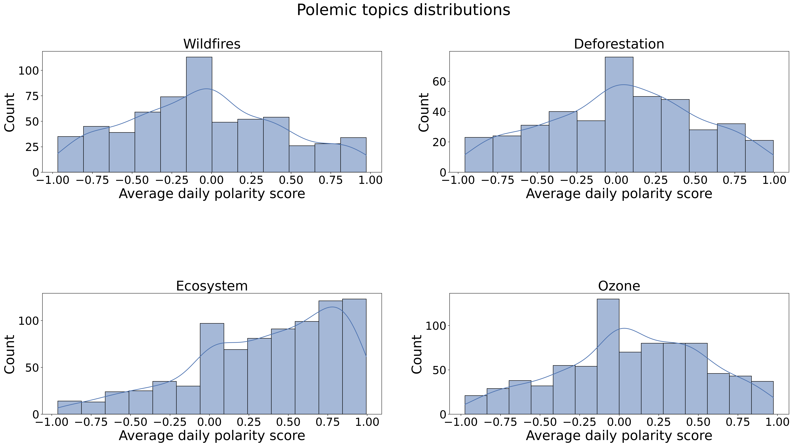
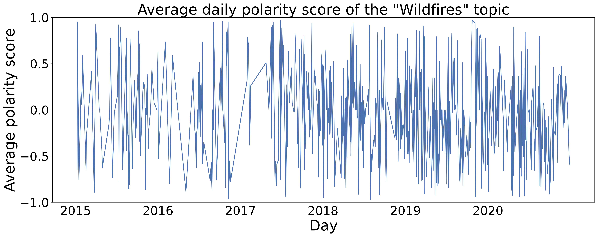
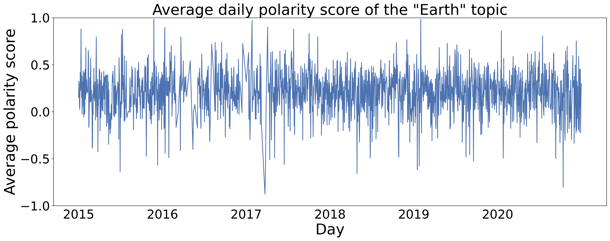

## How do we speak about climate ? The fine details of its narrative in the news

### What is polarization ?

Let us define polarization.

*Polarization: a state in which the opinions, beliefs, or interests of a group or society no longer range along a continuum but become concentrated at opposing extremes.*

In our case, we will try to measure the polarization of these different quotes by sentiment analysis i.e. polarity of sentiment.

### Evaluating polarization:

Given a sentence, we use VADER(Valence Aware Dictionary and sEntiment Reasoner) to compute the polarity score.

Valence, or hedonic tone, is the affective quality referring to the intrinsic attractiveness/"good"-ness (positive valence) or averseness/"bad"-ness (negative valence) of an object, in our case, text. The term also characterizes and categorizes specific emotions. For example, emotions popularly referred to as "negative", such as anger and fear, have negative valence. Joy has positive valence.

 Thus, our polarity score score is computed by summing the valence scores of each word in the quotation, adjusted according to the rules, and then normalized to be between -1 (most extreme negative) and +1 (most extreme positive).

### Evolution of polarization

Given this polarity score assigned to each quotation, we can now study its behaviour under multiple point of views (time, age, gender, political party) and look at if certain topics arise as more dividing than others.

#### Polarity score distribution throughout all quotations

Let us first look at the distribution of polarity score throughout 2015 to 2020.

As we can see (warning, log scale !), a majority of the quotations are considered neutral (score of 0.0).

The mean polarity score in our corpus is 0.27 with a standard deviation of 0.49. 

#### Polarity score for each year

Let us look at the distribution of each year to see if there's any year that stands out.

As we can see, polarity seems to be very constant throughout the years. Similarly, we looked throughout the months and didn't find anything significant.

Maybe, all we need is finer granularity ! Let's look at the daily average polarity score throughout the years.

Looking at the 2016 period, we might think that we have caught onto a particularly polarized period in the news! Who knows what very polarizing event happened during 2016 in the USA ? 

But looking closely, it's a matter of having much less data during 2016 which makes the mean very sensitive to outliers. Tough luck....

Therefore, as we can see, the average daily sentimental polarity of the quotation on climate change throughout the years is quite stable at around 0.27! Thus, the narrative around climate change seems to be slightly positive.

## Examining the different topics of climate change 

After seeing that there was no noticeable evolution of the polarization of the narrative around climate change in a global scale, we decided to dig a little further and examine the narrative around specific topics.

### Polemic topics

Polemic topics and polarization go hand in hand, therefore, a good first step would be to be able to classify a topic as controversial or not.

Looking at the definition of **controversy** from Werriam-Webster, we see: *"a discussion marked especially by the expression of opposing views".*

Thus, a topic whose daily polarity score is very stable throughout time would not be considered controversial, as around the same level of sentimental polarity is expressed each day (e.g. we need to breathe to live). 
 Whereas a topic where the daily polarity score tends to swing between -1 and 1, can be considered as a topic where there is expression of opposing views (e.g. anything about Trump).

Therefore, examining the empirical variance of the daily average polarity score of a given topic seems like a reasonable heuristic.

This heuristic obviously assumes that there aren't consistently opposing views that cancel each other exactly the same day. This assumption tends to be hold, when looking at the data and its quantity.

Using our heuristic, we extracted the top 4 most (non)polemic topics.

|    | Most polemic topics | Most non-polemic topics |
|----|---------------------|-------------------------|
| #1 | Wildfires           | Earth                   |
| #2 | Deforestation       | Climate                 |
| #3 | Ecosystem           | Gas                     |
| #4 | Ozone               | Sustainability          |

Let's take a look at the polarities of these topics throughout the years.

As we can see, non controversial topics have their distribution concentrated around a single polarity score which is positive for these 4 topics. 

The distributions are spread over the entire x axis which indicates a variety of opinions and a high likelihood of polarization. It is not the typical bimodal which represents the theorical polarized distribution but it is still quite different from the non-polemic topics. 

Looking a little more closely at the topic of "Wildfires" and "Earth", we can see how differently the narrative evolves through time.

As we can see, the topic of wildfires tends to exert much more extreme reactions than the "earth" topic. This is somewhat expected as wildfires are natural disasters that destroy forests and homes, thus creating emotional reactions.

#### Examples of quotes

To make things a little more fun and tangible, let us look at some quotes to get a better feeling of the narrative.

An example of a very negative quote around these polemic topics is: 

"*Where a complaint alleges, knowing governmental action is affirmatively and substantially **damaging the climate system** in a way that will cause **human deaths**, shorten human lifespans, result in widespread damage to property, threaten human food sources and **dramatically alter the planet's ecosystem**, it states a claim for a due process violation to hold. Otherwise, it would be to say that the constitution affords no protection against a **government's knowing decision to poison the air** its citizens breathe or the water its citizens drink.*"
 **Ann Aiken**, USA Oregon District judge.

An example of a very positive quote is: 

"*While the agenda on climate change looks precarious with president elect Trump's picks of climate change skeptics and denialists. Latin america is heading in the opposite direction. In 2017, we expect to increasingly hear actors in the private sector, banks and civil society making the case for why **action on climate change** is needed for **sustainable development**. Countries from the region strongly back the Paris climate agreement and in November many announced plans to **reduce emissions** and promote **renewable energy** during the UN climate change conference in Marrakech.[...]*" 
**Guy Edwards**, consultant focusing on climate change, geopolitics and Latin America.

#### Is the narrative polarized ?

When starting to work on the polarization of the narrative around climate change, we expected to see an opposition between a climate change skeptic narrative and a climate change alarmistic narrative. But, our findings don't back up our expectations.

Instead, as we can see from those two quotes, and it generalizes well to the rest of the corpus, quotes considered opposite by our sentimental polarity score tend to share a similar feeling: **Climate change is important and we need to act about it**. Indeed, the narrative around climate change can either be alarmistic about the current situation or hopeful and positive about the actions taken.

 Thus, either, the climate change skeptic narrative is actually much smaller than we think and is a case of a loud minority, or tools such as sentimental polarity and word embeddings are not the right tools to dissociate the two narratives.

