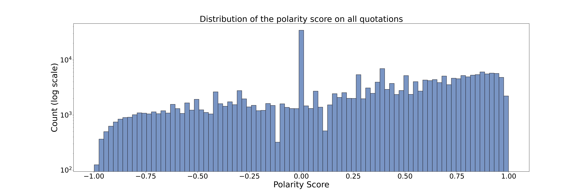
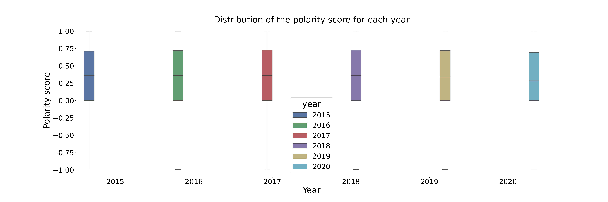
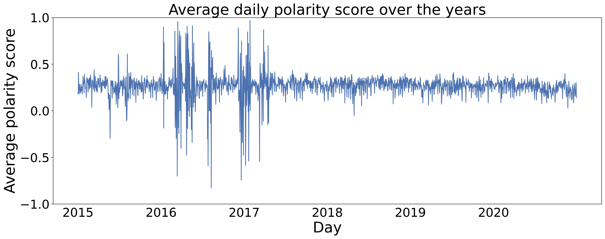

## How do we speak about climate ? The fine details of its narrative in the news

### What is polarization ?

Let us define polarization.

*Polarization: a state in which the opinions, beliefs, or interests of a group or society no longer range along a continuum but become concentrated at opposing extremes.*

In our case, we will try to measure the polarization of these different quotes by sentiment analysis i.e. polarity of sentiment.

### Evaluating polarization:

Given a sentence, we use VADER(Valence Aware Dictionary and sEntiment Reasoner) to compute the polarity score.

Valence, or hedonic tone, is the affective quality referring to the intrinsic attractiveness/"good"-ness (positive valence) or averseness/"bad"-ness (negative valence) of an object, in our case, text. The term also characterizes and categorizes specific emotions. For example, emotions popularly referred to as "negative", such as anger and fear, have negative valence. Joy has positive valence.

 Thus, our polarity score score is computed by summing the valence scores of each word in the quotation, adjusted according to the rules, and then normalized to be between -1 (most extreme negative) and +1 (most extreme positive).

### Evolution of polarization

Given this polarity score assigned to each quotation, we can now study its behaviour under multiple point of views (time, age, gender, political party) and look at if certain topics arise as more dividing than others.

#### Polarity score distribution throughout all quotations

Let us first look at the distribution of polarity score throughout 2015 to 2020.

As we can see (warning, log scale !), a majority of the quotations are considered neutral (score of 0.0).

The mean polarity score in our corpus is 0.27 with a standard deviation of 0.49. 

#### Polarity score for each year

Let us look at the distribution of each year to see if there's any year that stands out.

As we can see, polarity seems to be very constant throughout the years. Similarly, we looked throughout the months and didn't find anything significant.

Maybe, all we need is finer granularity ! Let's look at the daily average polarity score throughout the years.

Looking at the 2016 period, we might think that we have caught onto a particularly polarized period in the news! Who knows what very polarizing event happened during 2016 in the USA ? 

But looking closely, it's a matter of having much less data during 2016 which makes the mean very sensitive to outliers. Tough luck....

Therefore, as we can see, the average daily sentimental polarity of the quotation on climate change throughout the years is quite stable at around 0.25 !

We tried extracting seasonality of the polarity time series or observing outliers events but nothing significant was found.

### Polemic topics (time series analysis bb)